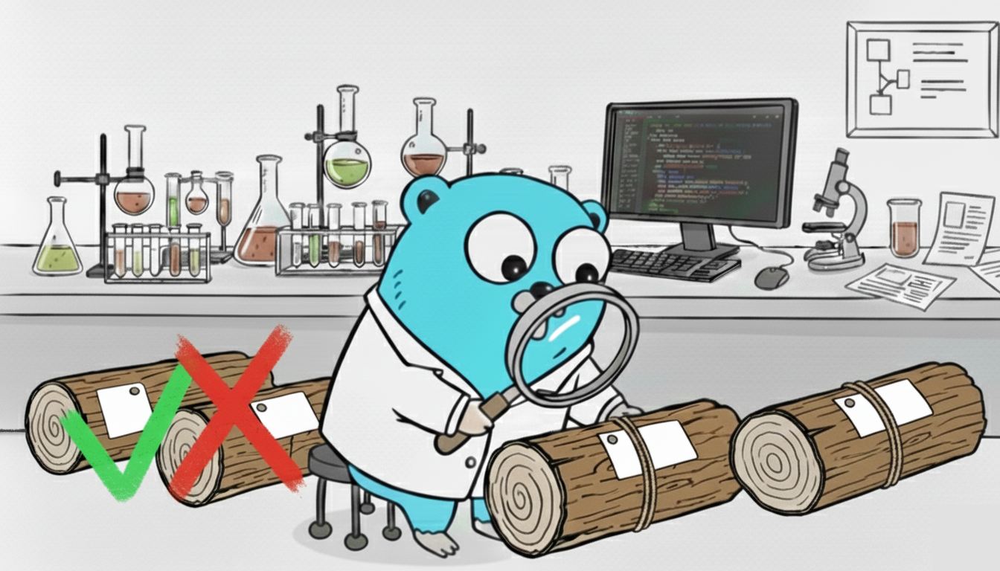

slogtesting
---

[](https://pkg.go.dev/github.com/rafaelespinoza/slogtesting)
[](https://github.com/rafaelespinoza/slogtesting/actions/workflows/tests.yaml)
[](https://codecov.io/gh/rafaelespinoza/slogtesting)

`slogtesting` is a golang library to test that your application's structured
logging outputs the intended data.
It requires the use of [log/slog](https://pkg.go.dev/log/slog).



## Features

* In-Memory Capture: Provides a `slog.Handler` that captures `slog.Record`
  golang values. This eases testing because there is no need to parse the
  formatted data. Instead, work directly with golang data structures.
* Simple: Integrates with the standard library's `*slog.Logger`.
* High-Level Checks: Includes helpers like `HasAttr` to simplify checking
  for specific key-value pairs in the captured logs. Use the `InGroup` check to
  compose many checks together in the expected shape of your data.
* Concurrency-Safe: Built to ensure that only 1 record is captured at a time in
  its entirety.

The said handler adheres to the same tests ([testing/slogtest](https://pkg.go.dev/testing/slogtest))
run against the standard library handlers `slog.TextHandler` and `slog.JSONHandler`.

Also provided are a set of `Check` functions to test attributes. They're higher
order functions: the input specifies something about a target attribute and the
return is a check function to run against a list of attributes. If the check
fails, an error is returned. This functional approach works well when you want
to inspect group attributes.

## The `testing` package

Though this is a testing library, at this time the API doesn't use `testing`.
This is because I couldn't figure out how to write tests that fail
successfully. That is, you can have tests that demonstrate the true negative
case, but AFAIK you can't run them automatically, as actual tests, without the
build failing. Those tests are designed to fail. For this reason, a `Check`
returns an error, which is very easy to test.

It's easy to adapt a `Check` to use `testing`.
```go
package main_test

import (
	"log/slog"
	"testing"

	st "github.com/rafaelespinoza/slogtesting"
)

func TestSimpleExample(t *testing.T) {
	attrs := []slog.Attr{slog.String("foo", "bar")}
	checks := []st.Check{
		st.HasKey("foo"),
		st.MissingKey("bar"),
		st.HasAttr(slog.String("foo", "bar")),
	}
	for _, check := range checks {
		err := check(attrs)
		if err != nil {
			t.Error(err)
		}
	}
}
```

Here's a more complete example using `testing`:
```go
package main_test

import (
	"log/slog"
	"testing"

	st "github.com/rafaelespinoza/slogtesting"
)

func TestCompleteExample(t *testing.T) {
	// Configure the handler if needed.
	opts := st.AttrHandlerOptions{HandlerOptions: slog.HandlerOptions{Level: slog.LevelInfo}}

	// This function is the part of your application to test. It's passed a
	// slog.Handler built to capture every processed slog.Record. This example
	// accumulates some data and outputs a record at the INFO level.
	run := func(h slog.Handler) error {
		logger := slog.New(h)

		// This output invocation will be recorded b/c the handler's logging
		// level will allow calls at the INFO level.
		//
		// If the handler was a *slog.TextHandler, the output would look similar to:
		// 	time=2006-01-02T15:04:05.012Z level=INFO msg=msg a=b G.c=d G.H.e=f
		logger.With("a", "b").WithGroup("G").With("c", "d").WithGroup("H").Info("msg", "e", "f")

		// This output won't be recorded b/c the level of the underlying handler
		// is above DEBUG.
		logger.Debug("You won't see me")

		return nil
	}
	records, err := st.CaptureRecords(&opts, run)
	if err != nil {
		t.Fatalf("unexpected error while capturing records: %v", err.Error())
	}
	if len(records) != 1 {
		t.Fatalf("wrong number of captured records; got %d, expected %d", len(records), 1)
	}

	// This is the output data to inspect. Collect the attributes for each
	// record that was output by the logger. It will also include the built-in
	// attributes: time, level, message.
	attrs := st.GetRecordAttrs(records[0])

	// Run these tests.
	tests := []struct {
		name  string
		check st.Check
	}{
		{
			name:  "key " + slog.TimeKey,
			check: st.HasKey(slog.TimeKey),
		},
		{
			name:  "key " + slog.LevelKey,
			check: st.HasKey(slog.LevelKey),
		},
		{
			name:  "attribute with key " + slog.MessageKey,
			check: st.HasAttr(slog.String(slog.MessageKey, "msg")),
		},
		{
			name:  "attribute with key a",
			check: st.HasAttr(slog.String("a", "b")),
		},
		{
			name:  "group G and attribute with key c",
			check: st.InGroup("G", st.HasAttr(slog.String("c", "d"))),
		},
		{
			name:  "group G, another group H and attribute with key e",
			check: st.InGroup("G", st.InGroup("H", st.HasAttr(slog.String("e", "f")))),
		},
		{
			name:  "should not find attribute with key z",
			check: st.MissingKey("z"),
		},
	}

	for _, test := range tests {
		t.Run(test.name, func(t *testing.T) {
			err := test.check(attrs)
			if err != nil {
				t.Errorf("unexpected error %v", err)
			}
		})
	}
}
```
